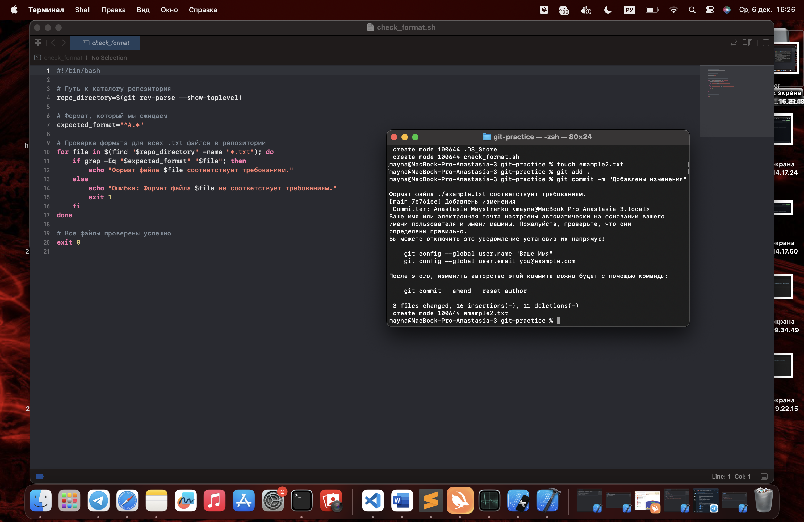

# Отчет по проделанной работе.

## Введение. 

Создание репозитория на GitHub:

Клонирование репозитория и добавление файла:

Создание ветки + редактирование файла:

## Работа с ветками.

Создание нового файла, ветки + внесенные изменения:

## Работа с удаленным репозиторием.

Внесение изменений в основной ветке:

## Моделирование конфликта.

Изменения главы №2:

## Разрешение конфликта.

Удаляем метки, пушим изменения:

## Автоматизация проверки формата файлов при коммите.

Создаем скрипт:

## Использование Git Flow в проекте.

Работа с __GitFlow__:

